# python_dataviz
## นายพรภิรมย์ โลจรัส 603020478-1
## 1.การติดตั้ง Anaconda 

1.ดาวโหลดและติดตั้งโปรแกรม Anaconda 

    2.เปิดโปรแกรมล็อก Folder โดยใช้คำสั่ง cd "ที่อยู่ Folder"
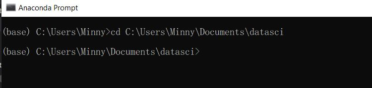
## 2.การใช้ Colab
 1.เข้า google พิมพ์ colab
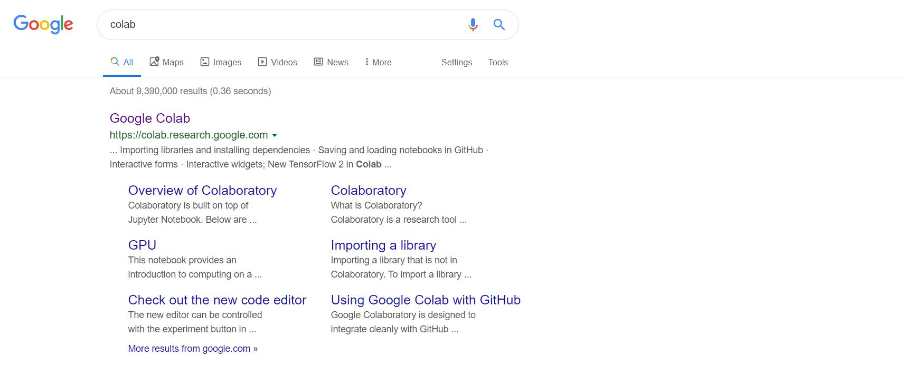
    2.กด File > New python 3 notebook
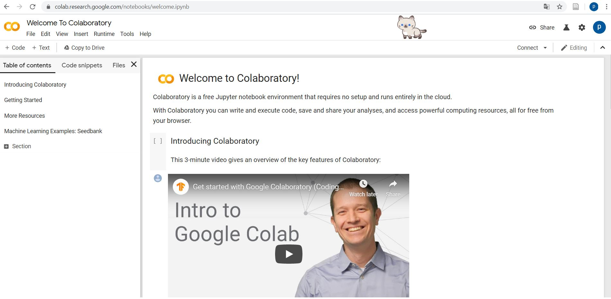
    3.พร้อมใช้งาน
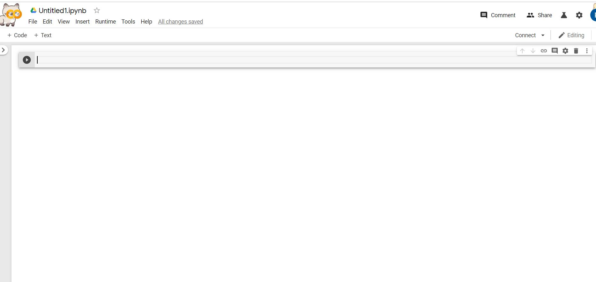
## 3.การใช้ Github
1.สมัครใช้งาน github 
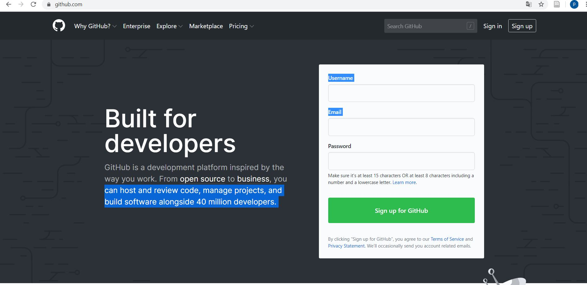
    2.install git ในโปรแกรม Anaconda โดยพิมพ์ 

    conda install -c anaconda git
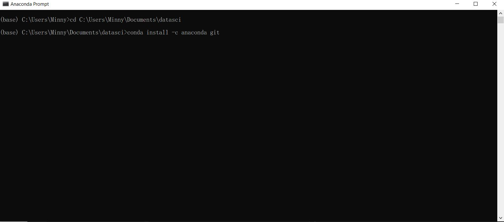
    3.กดที่ New repository
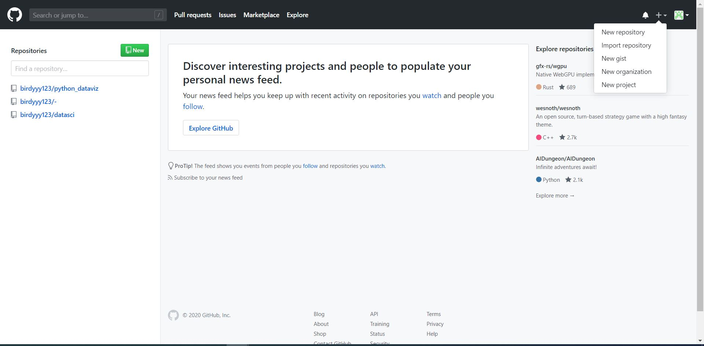
    4.ตั้งชื่อ Repository
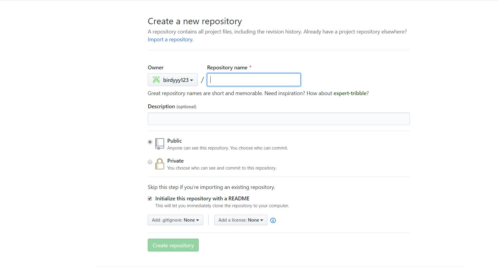
    5.copy URL งานของเรา
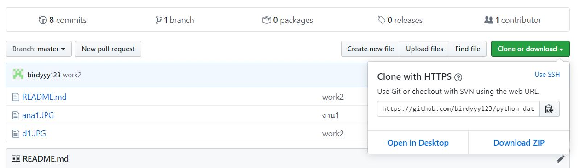
    6.วิธีเชื่อมงานของเรา พิมพ์ git clone "URL ของเรา"
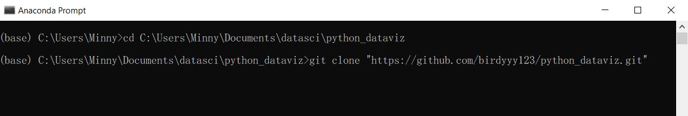
    7.คำสัง git status ใช้ดูว่าไฟล์ไหนที่ยังไม่ได้ add เข้าไปใน github
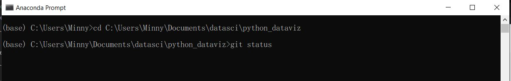
    8.คำสัง git add ใช้เพิ่มไฟล์ใน github
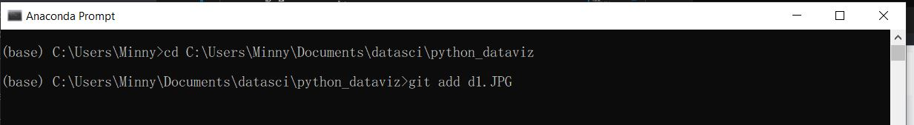
    9.คำสั่ง dir ใช้ดูว่าไฟล์ไหนที่เชื่อมกับ github แล้วบ้าง
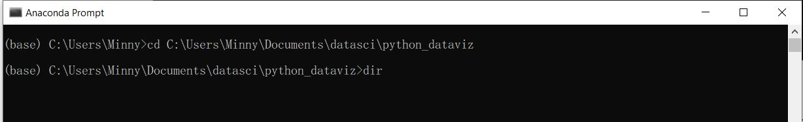
    10.คำสัง git commit -m "ทำอะไรอยู่" ใช้บอก่าดเรากำลังทำอะไร
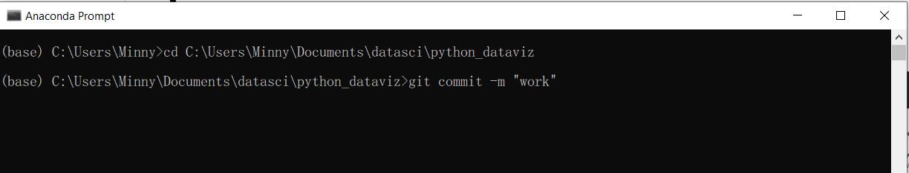
11.คำสั่ง git config --global user.email"อีเมลที่สมัคร" และ git config --global "usernameที่สมัคร"เพื่อเปิดใช้งาน github

12.คำสั่ง git push เพื่อ upload เข้า github และต้องใส่ username และ pessword ทุกครั้ง
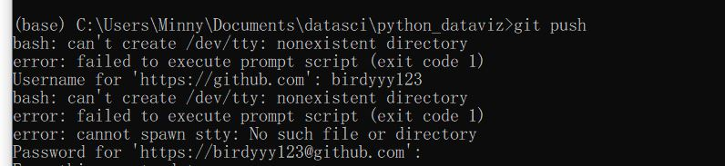