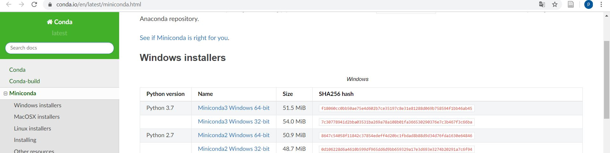
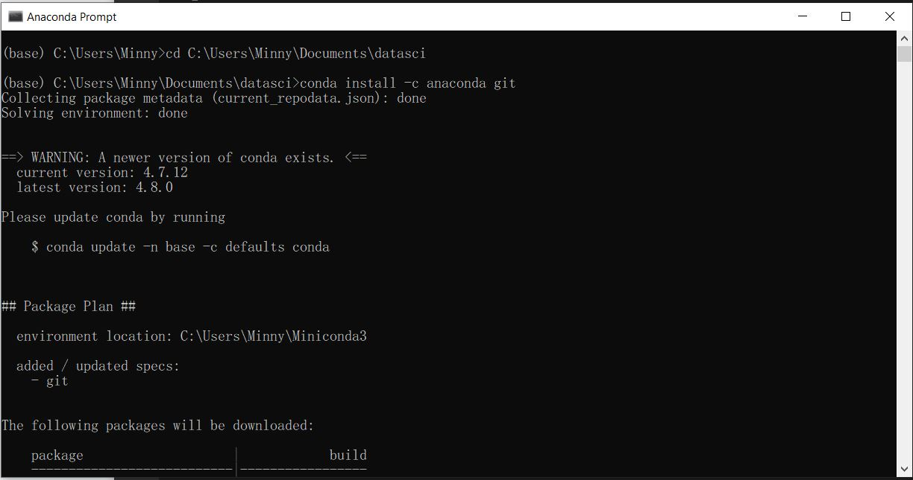

# python_dataviz
## 1.การติดตั้ง Anaconda 
    1.ดาวโหลดและติดตั้งโปรแกรม Anaconda 

    2.เปิดโปรแกรมล็อก Folder โดยใช้คำสั่ง cd "ที่อยู่ Folder"

## 2.การใช้ Colab
    1.เข้า google พิม colab

    